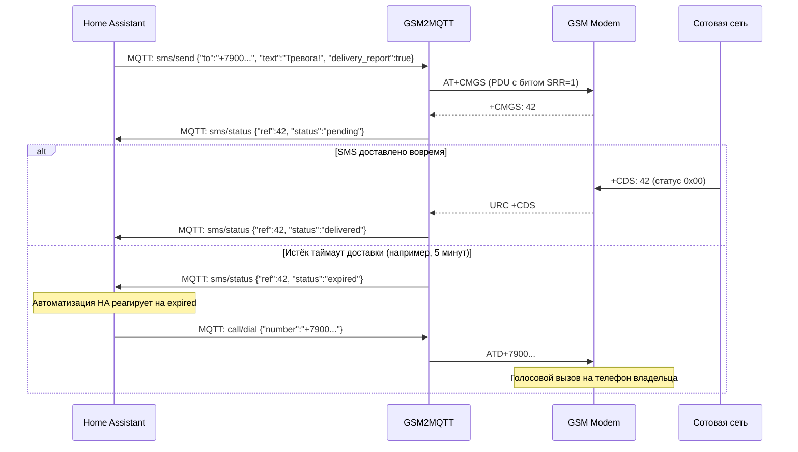

# GSM2MQTT — План развития и статус проекта (PLAN.md)

Дата актуализации: 22 сентября 2026 г.  
Репозиторий: `github.com/legoser/gsm2mqtt`  
Лицензия: Apache 2.0  
Целевая платформа: Linux x86_64, Linux ARM64 (OpenWRT, Raspberry Pi)

---

## 1. Сводка текущего состояния (Что реализовано)

### 1.1. Базовая инфраструктура и правила проекта
- [x] **Инициализация**: Go 1.22+ модуль, `git` репозиторий, ветка `development`.
- [x] **Стандарты качества ([`AGENTS.md`](AGENTS.md))**:
  - Строгий TDD: сначала тесты (RED), затем код (GREEN).
  - Принцип единственной ответственности: 1 файл — 1 задача (макс. 200 строк), 1 функция — 1 действие (макс. 40 строк).
  - Обязательные позитивные и негативные кейсы с типизированными ошибками (`errors.Is`).
  - Методология анализа границ (BVA), классов эквивалентности (EP) и автоматический фаззинг (`testing.F`).
  - Ровно 3 внешние зависимости (`go.bug.st/serial`, `paho.mqtt.golang`, `yaml.v3`).
- [x] **Сборка ([`Makefile`](Makefile))**:
  - `make build` и кросс-компиляция `make build-all` (`CGO_ENABLED=0` для amd64 и arm64).
  - Конфигурация [`.gitignore`](.gitignore), лицензия [`LICENSE`](LICENSE), [`README.md`](README.md).
- [x] **Конфигурация ([`internal/config`](internal/config))**:
  - Чтение YAML-файла с наложением ENV-переменных (`GSM2MQTT_*`).
  - Валидация полей, портов, топиков, режимов кодировок.
  - Сенситивные значения по умолчанию. 100% покрытие тестами.

### 1.2. Подсистема SMS и PDU-движок ([`internal/sms`](internal/sms), [`internal/sms/pdu`](internal/sms/pdu))
- [x] **Транслитерация кириллицы ([`translit.go`](internal/sms/translit.go))**:
  - Практический SMS-стандарт транслитерации для сохранения читаемости и расширения лимита до 160 символов.
- [x] **Кодировки GSM-7 и UCS-2**:
  - Таблица символов GSM-7 (128 символов базовой таблицы + extension table: `^`, `{`, `}`, `\`, `[`, `~`, `]`, `|`, `€`).
  - Упаковка 7-битных септетов в 8-битные октеты со сдвигами и паддингом, а также распаковка.
  - UCS-2 (UTF-16 Big Endian) кодирование/декодирование кириллицы.
- [x] **PDU кодировщик (SMS-SUBMIT) ([`encoder.go`](internal/sms/pdu/encoder.go))**:
  - Одиночные сообщения (до 160 симв. GSM-7 / до 70 симв. UCS-2).
  - Автонарезка multipart сообщений с формированием заголовков UDH (до 153 / 67 символов на сегмент).
  - Установка бита `TP-SRR` (Status Report Request) для запроса отчёта о доставке.
- [x] **PDU декодировщик (SMS-DELIVER) ([`decoder.go`](internal/sms/pdu/decoder.go))**:
  - Извлечение номера отправителя (OA), метки времени (SCTS), текста.
  - Распознавание UDH для составных SMS.
  - Полная защита от выхода за границы среза при битых данных.
- [x] **Декодировщик отчётов о доставке (SMS-STATUS-REPORT) ([`status_report.go`](internal/sms/pdu/status_report.go))**:
  - Парсинг URC `+CDS`.
  - Классификация статусов `TP-ST` (доставлено `0x00..0x1F`, временная ошибка `0x20..0x3F`, постоянный отказ `0x40..0x5F`).
- [x] **Сборщик составных сообщений ([`assembler.go`](internal/sms/assembler.go))**:
  - Склейка частей multipart сообщений, включая получение не по порядку.
  - Потокобезопасность (`sync.Mutex`) и очистка по TTL.
- [x] **Трекер доставки ([`tracker.go`](internal/sms/tracker.go))**:
  - Жизненный цикл доставки: `pending` → `delivered` / `failed`.
  - Таймер таймаута: статус `expired` при отсутствии ответа сети для эскалации в звонок.
- [x] **Валидация и нормализация номеров и текста ([`validator.go`](internal/sms/validator.go))**:
  - Очистка форматирования: скобки, дефисы, пробелы.
  - Приведение национального формата `8900...` к международному `+7900...`.
  - Поддержка коротких номеров (`112`, `900`).
  - Защита от опасных байтов: `\x00` (Null byte) и `\x1A` (Ctrl+Z).
- [x] **Автоматический фаззинг (`testing.F`)**:
  - `FuzzNormalizePhoneNumber` (160k+ итераций) и `FuzzDecodeSMS` (150k+ итераций) без паник.

### 1.3. Подсистема USSD-команд ([`internal/ussd`](internal/ussd))
- [x] Валидация формата USSD (`*100#`, `*111*1#`, `#100#`).
- [x] Парсинг URC `+CUSD: <m>,<str>,<dcs>`.
- [x] Автоматическое декодирование кириллицы в UCS-2 hex (DCS 72).
- [x] Поддержка многострочных меню оператора (`<m> = 1`).
- [x] Типизированные ошибки сети (`ErrUSSDTimeout`, `ErrUSSDTerminated`, `ErrUSSDNotSupported`).
- [x] Фаззинг-тест `FuzzParseResponse` (176k+ итераций).

---

## 2. Архитектурный план

### 2.1. Иерархия пакетов и изоляция модулей

```
cmd/gsm2mqtt/ (точка входа, wiring)
    ↓
internal/config/       (YAML, ENV, валидация; независим)
internal/transport/    (Serial port; независим)
internal/modem/        (Driver, Detector; зависит от transport)
    ├── at/            (AT Engine, Command dispatch, URC router)
    └── drivers/       (Siemens, SIMCom, Huawei, Generic)
internal/sms/          (PDU encoder/decoder, assembler, tracker; независим)
internal/ussd/         (Парсер USSD, DCS 72 декодер; независим)
internal/security/     (Rate limiting, фильтр номеров, санитизатор; независим)
internal/mqtt/         (MQTT клиент, HA Discovery, топики; независим)
internal/services/     (Оркестрация: связывает modem, mqtt, sms, ussd, security)
```

### 2.2. Сценарий эскалации тревоги (SMS → Timeout → Voice Call)



---

## 3. TODO-лист по фазам

### Фаза 0: Инициализация и основы [ВЫПОЛНЕНО НА 100%]
- [x] Создание структуры репозитория и модулей Go
- [x] Разработка документации стандартов кода [`AGENTS.md`](AGENTS.md)
- [x] Реализация загрузчика конфигурации и тестов
- [x] Подготовка TDD-каркаса (набор RED-тестов для всех модулей)

---

### Фаза 1: Ядро системы (SMS, Звонки, USSD, Безопасность) [ВЫПОЛНЕНО НА 100%]

#### Подсистема SMS и USSD
- [x] Реализация транслитератора кириллицы
- [x] Реализация PDU-кодировщика (GSM-7, UCS-2, UDH, SRR)
- [x] Реализация PDU-декодировщика с защитой от битых пакетов
- [x] Реализация сборщика составных SMS (Assembler)
- [x] Реализация трекера отчётов о доставке (Tracker)
- [x] Реализация парсера и декодера USSD (DCS 72 / 15)
- [x] Валидация номеров (E.164, '8'->'+7', короткие коды)
- [x] Фаззинг-тесты нормализатора, PDU-декодера и USSD

#### Подсистема безопасности (`internal/security`)
- [x] **RateLimiter**: скользящее окно (минута, час, день, лимит на номер).
- [x] **Filter**: проверка номеров по режимам `all`, `whitelist`, `blacklist`.
- [x] **Sanitizer**: блокировка деструктивных AT-команд (`AT+CFUN=0`, `AT+CPIN`, `AT&F`, `ATD`).
- [x] Негативные тесты и проверка граничных условий безопасности.
- [x] Автоматический фаззинг `FuzzFilter` (241k+ итераций) и `FuzzSanitizer` (237k+ итераций).

#### Ядро AT-команд и модемные драйверы (`internal/modem`)
- [x] **AT Engine (`internal/modem/at`)**:
  - Потокобезопасная отправка команд с таймаутами.
  - Разбор синхронных ответов (`OK`, `ERROR`, `+CME ERROR`, `+CMS ERROR`).
  - Маршрутизация асинхронных URC (`+CMTI:`, `+CLIP:`, `+DTMF:`, `+CDS:`, `+CUSD:`).
- [x] **Transport (`internal/transport`)**:
  - Адаптер к библиотеке `go.bug.st/serial`.
  - Управление DTR/RTS, baud rate, parity, stop bits, flow control.
- [x] **Modem Detector (`internal/modem/detector.go`)**:
  - Автоматическое определение Siemens, SIMCom, Huawei, Quectel, Generic через `ATI` / `AT+CGMI` / `AT+CGMM`.
- [x] **Драйверы модемов (`internal/modem/drivers`)**:
  - Базовые команды: инициализация (`ATE0`, `AT+CMEE=2`, `AT+CMGF=0`, `AT+CNMI=2,1,0,1,0`, `AT+CLIP=1`).
  - Siemens TC35/MC55/TC65 (особенности RS-232, авто-baud).
  - SIMCom SIM800/SIM900 (UART особенности, пробуждение CSCLK).
  - Huawei USB (stick mode, AT-порт).
  - Generic AT fallback.

#### Сервисы и интеграция с MQTT (`internal/services`, `internal/mqtt`)
- [x] **Voice Call Service (`internal/services/call.go`)**:
  - Набор (`ATD...;`), ответ (`ATA`), отбой (`ATH`), прием DTMF (`+DTMF`).
- [x] **SMS Service (`internal/services/sms.go`)**:
  - Оркестрация: MQTT запрос → RateLimit/Filter → PDU Encode → AT Send → Delivery Tracker.
- [x] **USSD Service (`internal/services/ussd.go`)**:
  - Отправка USSD → ожидание синхронного ответа или URC `+CUSD:` → публикация в MQTT.
- [x] **Status Service (`internal/services/status.go`)**:
  - Опрос RSSI/dBm, регистрации, оператора, SIM статуса.
- [x] **MQTT Client & Topics (`internal/mqtt`)**:
  - Подключение к брокеру (Paho + Mock), QoS, LWT (Last Will: `gsm2mqtt/status`).
  - Генератор топиков и обработчики входящих топиков (`sms/send`, `call/dial`, `call/hangup`, `ussd/send`).
  - Генератор конфигурации Home Assistant MQTT Auto-Discovery.
- [x] **Modem Runner (`internal/services/gateway.go`)**:
  - Полная оркестрация жизненного цикла модема, URC loop, MQTT pub/sub подписок.
- [x] **Сборка точки входа (`cmd/gsm2mqtt/main.go`)**:
  - Инициализация всех слоёв (Dependency Injection), graceful shutdown по сигналам SIGINT/SIGTERM.

---

### Фаза 2: Диагностика, баланс и расширенные функции [ВЫПОЛНЕНО НА 100%]
- [x] **Канал здоровья и готовности модема**:
  - Публикация состояний (`ready`, `degraded`, `not_ready`, `error`) в `gsm2mqtt/modem/{id}/health`.
  - Срочный канал алертов: `gsm2mqtt/modem/{id}/alert`.
- [x] **Автоматическая диагностика сбоев**:
  - При ошибке отправки SMS или выхода в интернет: автопроверка SIM (`AT+CPIN?`), регистрации (`AT+CREG?`), уровня сигнала (`AT+CSQ`) и баланса.
  - Детализированный отчёт в топик `modem/{id}/diagnostic`.
- [x] **Пресеты операторов для контроля баланса**:
  - Встроенные пресеты для МТС, Мегафон, Билайн, Tele2 с regex-парсингом остатка рублей.
  - Динамическое переопределение пресетов через MQTT/YAML.
- [x] **Тарифный менеджер и учёт лимитов**:
  - Счётчики отправленных SMS за день/месяц со сбросом в заданный день.
  - Контроль интернет-трафика (МБ).
  - Предупреждения при исчерпании 90% пакета или снижении баланса ниже порога.
- [x] **GPRS / HTTP через AT-команды**:
  - Реализация простых HTTP GET/POST запросов через стек модема (`AT+HTTP*`) без PPP/pppd (для Telegram-ботов и резервных вебхуков).
- [x] **Минимальный Web API**:
  - Просмотр статуса, уровня сигнала и отправка тестовых SMS через браузер.

---

### Фаза 3: Масштабирование и расширенные платформы [ВЫПОЛНЕНО НА 100%]
- [x] **Пул из нескольких модемов (Multi-modem: балансировка нагрузки, резервирование SIM)**:
  - Пул модемов `internal/pool` со стратегиями: `round-robin`, `failover`, `best-signal`, `operator-match`.
  - Автоматический повтор (Failover Retry) при сбое основного модема.
  - Общие кластерные топики MQTT (`{prefix}/sms/send`, `{prefix}/call/dial`, `{prefix}/call/hangup`, `{prefix}/ussd/send`) и статус пула (`{prefix}/pool/status`).
  - Unit-тесты и фаззинг селектора пула `FuzzPool_Selection` (396k+ итераций).
- [x] **Поддержка RISC-V архитектуры**:
  - Кросс-компиляция без CGO (`CGO_ENABLED=0 GOOS=linux GOARCH=riscv64`).
  - Добавление целей `build-riscv64` и расширение `build-all` в `Makefile`.
  - Сборка и верификация чистого статического ELF 64-bit LSB исполняемого файла.
- [x] **Экспорт метрик Prometheus (`/metrics`)**:
  - Встроенный легковесный реестр метрик `internal/metrics` (без внешних зависимостей).
  - Формат экспорта Prometheus 0.0.4 (`# HELP`, `# TYPE`, экранирование лейблов).
  - Счётчики и метрики уровня сигнала, статуса модемов, баланса, квот тарифа, SMS, звонков и пула.
  - Эндпоинт `GET /metrics` в HTTP-сервере `internal/api`.
  - Фаззинг валидатора лейблов `FuzzRegistry_FormatLabels` (120k+ итераций).
