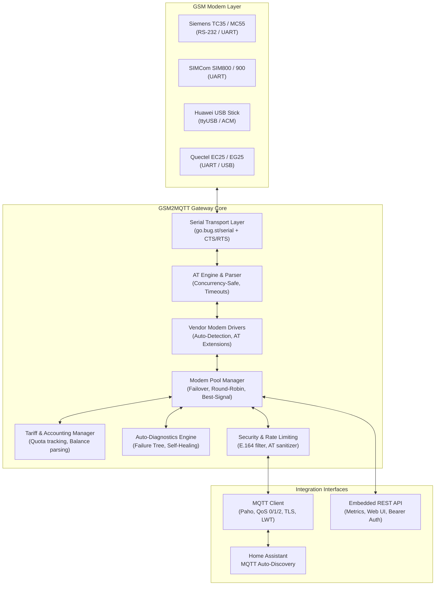
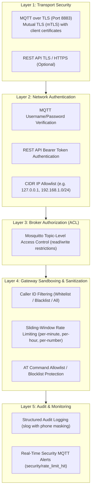
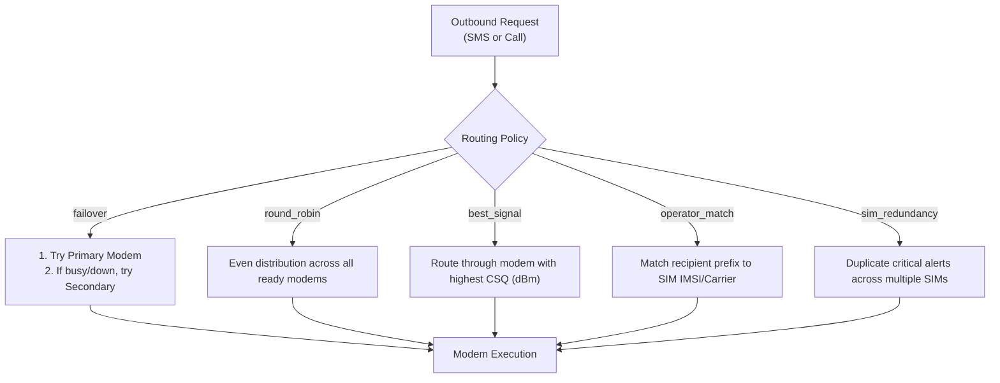
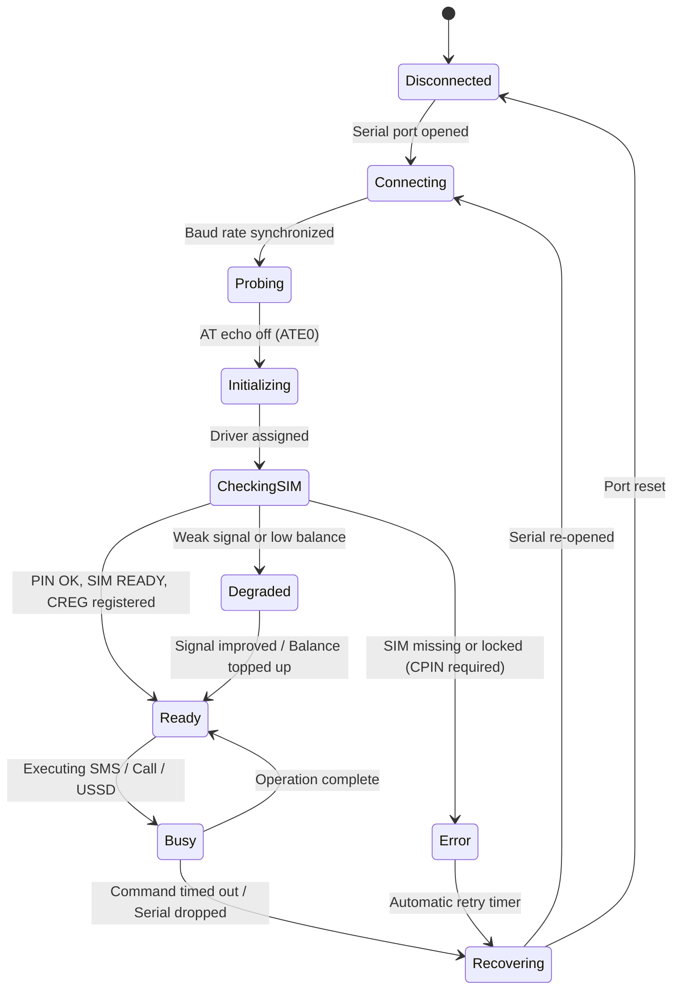
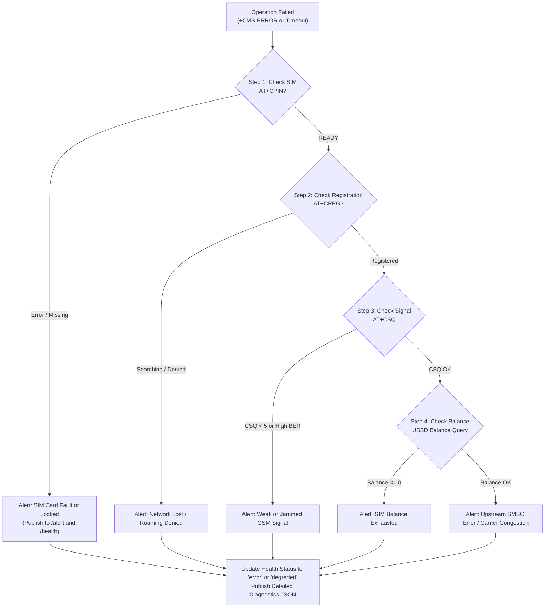

# GSM2MQTT: Architecture & System Design

This document details the internal architecture, component design, multi-modem routing, and security model of **GSM2MQTT** for users and third-party developers.

---

## 1. System Overview

GSM2MQTT is a high-performance, concurrent gateway written in Go that bridges physical GSM/3G/4G modems with MQTT-based smart home systems (such as Home Assistant, Node-RED, and OpenHAB).

---

## 2. Multi-Layer Security Architecture

GSM2MQTT operates under a strict defense-in-depth model across 5 concentric security boundaries:

### Protection Against SMS Bombing and Loops
- **Sliding-Window Rate Limiter**: Tracks global SMS dispatch rates (e.g. 5/min, 30/hour, 100/day) as well as per-recipient limits to eliminate infinite loops in home automation rules.
- **AT Command Sandboxing**: When raw AT command execution via MQTT is enabled, dangerous commands (`AT+CFUN=0`, `AT+CPIN`, `AT&F`, `ATD`) are blocked to prevent modem shutdown, NVRAM corruption, or PIN locking.

---

## 3. Modem Pool & Multi-Modem Routing

When multiple modems are connected, the gateway treats them as a managed pool. The pool supports several routing policies configured via YAML:

### Supported Routing Strategies
1. **`failover`** (Default for high availability): Prioritizes the primary modem. If the primary modem loses registration, runs out of balance, or experiences hardware failure, traffic reroutes transparently to the secondary modem.
2. **`round-robin`**: Distributes outbound messages evenly across all operational modems. Useful when modems have separate SMS bundles.
3. **`best-signal`**: Dynamically evaluates the current signal quality (`CSQ`) and directs traffic through the modem experiencing the best connection.
4. **`operator-match`**: Analyzes recipient phone number prefixes and selects the SIM card belonging to the same mobile operator to minimize SMS costs.
5. **`sim-redundancy`**: Sends critical emergency notifications through multiple physical modems simultaneously.

---

## 4. Modem Lifecycle State Machine

Each modem runner operates a state machine that handles hotplugging, automatic reconnection, and error recovery without service restarts:

---

## 5. Automated Diagnostic Failure Tree

When an outbound operation fails (e.g. SMS delivery fails with `+CMS ERROR`), GSM2MQTT does not simply return an error; it executes an **automated diagnostic pipeline** to isolate the root cause:

---

## 6. Concurrency and Thread Safety

- **Port Mutexing**: Serial ports are protected by strict per-modem mutexes to prevent interleaving of concurrent AT commands, asynchronous notifications (URCs), and USSD sessions.
- **Context Propagation**: Every operation (SMS, USSD, dial) accepts a `context.Context` with hard deadlines. If a serial line hangs, the timeout triggers, cleans up buffers, and unblocks the calling goroutine.
- **Lock-Free MQTT Publishing**: Alerting and MQTT event dispatch occur outside of internal tariff or driver mutex locks, eliminating deadlock possibilities.
