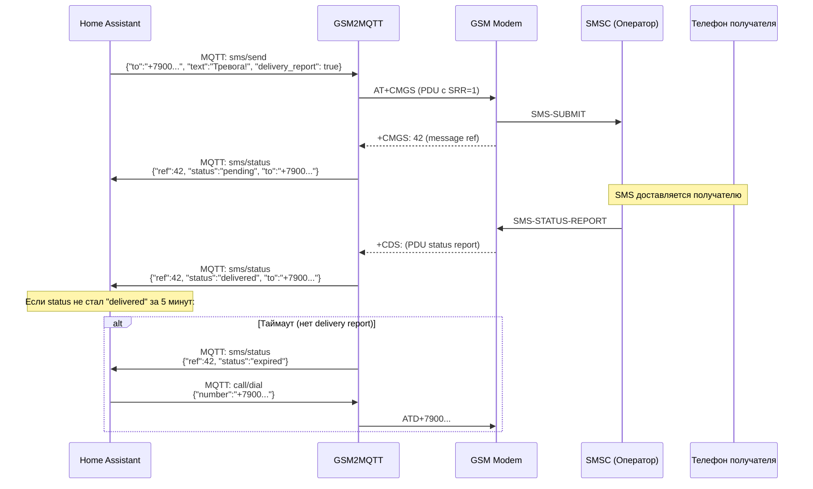
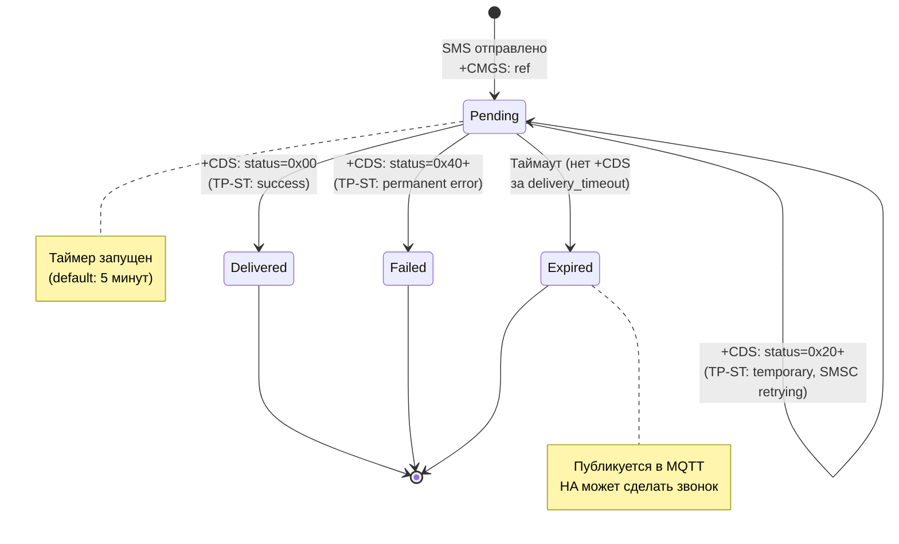

# GSM2MQTT — SMS Delivery Reports (дополнение к плану)

## Описание

SMS Delivery Report (Status Report) — стандартная функция GSM-сети. Когда вы отправляете SMS с запросом отчёта о доставке, SMSC (центр обработки сообщений оператора) уведомляет модем, когда SMS доставлено получателю (или не доставлено).

**Сценарий пользователя:**
1. Home Assistant отправляет тревожное SMS через GSM2MQTT
2. GSM2MQTT публикует статус `pending` в MQTT
3. Получатель получает SMS → сеть присылает delivery report → GSM2MQTT публикует `delivered`
4. **Если delivery report не пришёл за N минут** → GSM2MQTT публикует `expired` → Home Assistant делает голосовой звонок через Siemens

---

## Как это работает на уровне GSM



---

## Реализация в GSM2MQTT

### 1. Запрос Delivery Report при отправке (PDU)

В PDU mode запрос delivery report делается установкой **бита SRR (Status Report Request)** в первом октете TPDU:

```
Первый октет SMS-SUBMIT:
Бит 7  6  5  4  3  2  1  0
    RP UDHI SRR VPF VPF RD MTI MTI
              ↑
              SRR = 1 → запросить отчёт о доставке
```

```go
// internal/sms/pdu/encoder.go

const (
    mtiSubmit  = 0x01 // SMS-SUBMIT
    bitSRR     = 0x20 // Бит 5: Status Report Request
    bitUDHI    = 0x40 // Бит 6: User Data Header Indicator
    vpfRelative = 0x10 // Биты 4-3: Relative Validity Period
)

func buildFirstOctet(requestDeliveryReport bool, hasUDH bool) byte {
    fo := byte(mtiSubmit | vpfRelative) // 0x11
    if requestDeliveryReport {
        fo |= bitSRR // 0x31
    }
    if hasUDH {
        fo |= bitUDHI // +0x40
    }
    return fo
}
```

### 2. Настройка модема для приёма Status Reports

При инициализации модема настраиваем маршрутизацию delivery reports:

```go
// internal/modem/drivers/common.go

// initDeliveryReports настраивает модем для приёма SMS-STATUS-REPORT.
func initDeliveryReports(engine *at.Engine) error {
    // AT+CNMI=2,1,0,1,0
    //                 ↑ ds=1: маршрутизировать STATUS-REPORT через +CDS URC
    _, err := engine.Send("AT+CNMI=2,1,0,1,0", 5*time.Second)
    return err
}
```

**Параметры AT+CNMI:**

| Параметр | Значение | Описание |
|:---|:---|:---|
| mode=2 | | Буферизировать URC и отправлять на TE |
| mt=1 | | Новые SMS → `+CMTI` уведомление |
| bm=0 | | Cell Broadcast — не маршрутизировать |
| **ds=1** | ✅ | **STATUS-REPORT → `+CDS` URC** |
| bfr=0 | | Буфер не очищать |

### 3. Приём и декодирование Status Report

Когда delivery report приходит, модем генерирует URC (Unsolicited Result Code):

```
+CDS: 25
07919761989901F006440B919710...  (PDU hex)
```

#### [NEW] internal/sms/pdu/status_report.go

```go
package pdu

// StatusReport представляет декодированный SMS-STATUS-REPORT.
type StatusReport struct {
    MessageRef   byte       // TP-MR: ссылка на оригинальное SMS
    Recipient    string     // TP-RA: номер получателя
    SCTimestamp  time.Time  // TP-SCTS: когда SMSC получил SMS
    Discharge    time.Time  // TP-DT: когда SMS доставлено/отклонено
    Status       DeliveryStatus // TP-ST: статус доставки
}

// DeliveryStatus — код статуса доставки из TP-ST (1 байт).
type DeliveryStatus byte

const (
    // Успешная доставка (0x00 - 0x1F)
    StatusDelivered              DeliveryStatus = 0x00 // SMS доставлено
    StatusForwardedNotConfirmed  DeliveryStatus = 0x01 // Переслано, подтверждение не получено
    StatusReplacedBySC           DeliveryStatus = 0x02 // Заменено на SC

    // Временные ошибки (0x20 - 0x3F) — SMSC продолжает попытки
    StatusTempCongestion         DeliveryStatus = 0x20 // Перегрузка сети
    StatusTempBusy               DeliveryStatus = 0x21 // Абонент занят
    StatusTempNoResponse         DeliveryStatus = 0x22 // Абонент не отвечает
    StatusTempServiceRejected    DeliveryStatus = 0x23 // Сервис отклонён
    StatusTempQoSUnavailable     DeliveryStatus = 0x24 // QoS недоступен
    StatusTempErrorInSME         DeliveryStatus = 0x25 // Ошибка в SME

    // Постоянные ошибки (0x40 - 0x5F) — доставка невозможна
    StatusPermRemoteError        DeliveryStatus = 0x40 // Ошибка удалённого устройства
    StatusPermIncompatibleDest   DeliveryStatus = 0x41 // Несовместимый получатель
    StatusPermRejectedBySME      DeliveryStatus = 0x42 // Отклонено получателем
    StatusPermNotObtainable      DeliveryStatus = 0x43 // Недоступен
    StatusPermQoSUnavailable     DeliveryStatus = 0x44 // QoS не поддерживается
    StatusPermNoInterworking     DeliveryStatus = 0x45 // Нет interworking
    StatusPermVPExpired          DeliveryStatus = 0x46 // Validity Period истёк
    StatusPermDeletedByOrigSME   DeliveryStatus = 0x47 // Удалено отправителем
    StatusPermDeletedBySC        DeliveryStatus = 0x48 // Удалено SC
    StatusPermNotExist           DeliveryStatus = 0x49 // SMS не существует
)

// IsDelivered возвращает true, если SMS успешно доставлено.
func (s DeliveryStatus) IsDelivered() bool {
    return s <= 0x1F
}

// IsTemporary возвращает true, если ошибка временная (SMSC ещё пытается).
func (s DeliveryStatus) IsTemporary() bool {
    return s >= 0x20 && s <= 0x3F
}

// IsPermanent возвращает true, если доставка невозможна.
func (s DeliveryStatus) IsPermanent() bool {
    return s >= 0x40 && s <= 0x5F
}

// String возвращает человеко-читаемое описание статуса.
func (s DeliveryStatus) String() string {
    switch {
    case s == StatusDelivered:
        return "delivered"
    case s.IsTemporary():
        return "pending"    // SMSC ещё пытается
    case s.IsPermanent():
        return "failed"
    default:
        return fmt.Sprintf("unknown(0x%02X)", byte(s))
    }
}

// DecodeStatusReport декодирует PDU SMS-STATUS-REPORT.
func DecodeStatusReport(pduHex string) (*StatusReport, error) {
    data, err := hex.DecodeString(pduHex)
    if err != nil {
        return nil, fmt.Errorf("invalid PDU hex: %w", err)
    }
    
    sr := &StatusReport{}
    offset := 0
    
    // 1. SCA (Service Center Address)
    scaLen := int(data[offset])
    offset += 1 + scaLen
    
    // 2. First Octet (MTI=10 → STATUS-REPORT)
    // Проверяем, что MTI = 0x02
    offset++
    
    // 3. TP-MR (Message Reference) — ссылка на исходное SMS
    sr.MessageRef = data[offset]
    offset++
    
    // 4. TP-RA (Recipient Address) — номер получателя
    sr.Recipient = decodeAddress(data, &offset)
    
    // 5. TP-SCTS (Service Centre Time Stamp) — 7 байт BCD
    sr.SCTimestamp = decodeTimestamp(data[offset:])
    offset += 7
    
    // 6. TP-DT (Discharge Time) — 7 байт BCD
    sr.Discharge = decodeTimestamp(data[offset:])
    offset += 7
    
    // 7. TP-ST (Status) — 1 байт
    sr.Status = DeliveryStatus(data[offset])
    
    return sr, nil
}
```

### 4. Delivery Tracker — отслеживание статусов

#### [NEW] internal/sms/tracker.go

```go
package sms

// Tracker отслеживает статус доставки отправленных SMS.
// Хранит pending-записи и генерирует события timeout/expired.
type Tracker struct {
    mu       sync.Mutex
    pending  map[byte]*TrackedSMS  // key: message reference (TP-MR)
    timeout  time.Duration         // Таймаут ожидания delivery report
    onUpdate func(event DeliveryEvent)
    logger   *slog.Logger
}

// TrackedSMS — отслеживаемое SMS.
type TrackedSMS struct {
    MessageRef byte
    To         string
    Text       string
    SentAt     time.Time
    ModemID    string
    Timer      *time.Timer  // Таймер таймаута
}

// DeliveryEvent — событие доставки для публикации в MQTT.
type DeliveryEvent struct {
    MessageRef   byte              `json:"ref"`
    To           string            `json:"to"`
    Status       string            `json:"status"`     // pending, delivered, failed, expired
    StatusCode   *byte             `json:"status_code,omitempty"` // TP-ST код (если есть)
    StatusDetail string            `json:"status_detail,omitempty"`
    SentAt       string            `json:"sent_at"`
    DeliveredAt  string            `json:"delivered_at,omitempty"`
    ExpiredAt    string            `json:"expired_at,omitempty"`
    Elapsed      string            `json:"elapsed,omitempty"`     // Время от отправки до доставки
    ModemID      string            `json:"modem_id"`
}

// Track регистрирует отправленное SMS для отслеживания доставки.
func (t *Tracker) Track(ref byte, to, text, modemID string) {
    t.mu.Lock()
    defer t.mu.Unlock()
    
    tracked := &TrackedSMS{
        MessageRef: ref,
        To:         to,
        Text:       text,
        SentAt:     time.Now(),
        ModemID:    modemID,
    }
    
    // Запускаем таймер таймаута
    tracked.Timer = time.AfterFunc(t.timeout, func() {
        t.handleTimeout(ref)
    })
    
    t.pending[ref] = tracked
    
    // Публикуем событие "pending"
    t.onUpdate(DeliveryEvent{
        MessageRef: ref,
        To:         to,
        Status:     "pending",
        SentAt:     tracked.SentAt.Format(time.RFC3339),
        ModemID:    modemID,
    })
}

// HandleReport обрабатывает входящий SMS-STATUS-REPORT.
func (t *Tracker) HandleReport(report *pdu.StatusReport) {
    t.mu.Lock()
    defer t.mu.Unlock()
    
    tracked, ok := t.pending[report.MessageRef]
    if !ok {
        t.logger.Warn("delivery report for unknown message",
            slog.Int("ref", int(report.MessageRef)))
        return
    }
    
    // Остановить таймер
    tracked.Timer.Stop()
    
    elapsed := report.Discharge.Sub(tracked.SentAt)
    statusCode := byte(report.Status)
    
    event := DeliveryEvent{
        MessageRef:   report.MessageRef,
        To:           tracked.To,
        SentAt:       tracked.SentAt.Format(time.RFC3339),
        DeliveredAt:  report.Discharge.Format(time.RFC3339),
        Elapsed:      elapsed.String(),
        StatusCode:   &statusCode,
        StatusDetail: report.Status.String(),
        ModemID:      tracked.ModemID,
    }
    
    if report.Status.IsDelivered() {
        event.Status = "delivered"
        delete(t.pending, report.MessageRef)
    } else if report.Status.IsPermanent() {
        event.Status = "failed"
        delete(t.pending, report.MessageRef)
    } else {
        // Временная ошибка — SMSC ещё пытается, не удаляем
        event.Status = "pending"
    }
    
    t.onUpdate(event)
}

// handleTimeout вызывается когда delivery report не пришёл за timeout.
func (t *Tracker) handleTimeout(ref byte) {
    t.mu.Lock()
    defer t.mu.Unlock()
    
    tracked, ok := t.pending[ref]
    if !ok {
        return
    }
    
    delete(t.pending, ref)
    
    t.onUpdate(DeliveryEvent{
        MessageRef: ref,
        To:         tracked.To,
        Status:     "expired",
        SentAt:     tracked.SentAt.Format(time.RFC3339),
        ExpiredAt:  time.Now().Format(time.RFC3339),
        Elapsed:    time.Since(tracked.SentAt).String(),
        ModemID:    tracked.ModemID,
    })
}
```

---

## MQTT Топики для Delivery Reports

```
gsm2mqtt/modem/{modem_id}/sms/
├── send              # ← Команда: отправить SMS
├── sent              # → Подтверждение отправки (modem accepted)
├── send_status       # → Ошибка отправки
├── status            # → 📦 Delivery Report Events (NEW!)
└── received          # → Входящие SMS
```

### Отправка SMS с запросом delivery report

**Топик:** `gsm2mqtt/modem/{id}/sms/send`

```json
{
  "to": "+79001234567",
  "text": "Сработала сигнализация!",
  "delivery_report": true
}
```

> Поле `delivery_report` — **опционально**. По умолчанию определяется конфигом.

### События доставки

**Топик:** `gsm2mqtt/modem/{id}/sms/status`

#### Событие: SMS отправлено (pending)
```json
{
  "ref": 42,
  "to": "+79001234567",
  "status": "pending",
  "sent_at": "2026-09-22T09:40:00+07:00",
  "modem_id": "siemens_tc35"
}
```

#### Событие: SMS доставлено (delivered)
```json
{
  "ref": 42,
  "to": "+79001234567",
  "status": "delivered",
  "status_code": 0,
  "status_detail": "delivered",
  "sent_at": "2026-09-22T09:40:00+07:00",
  "delivered_at": "2026-09-22T09:40:12+07:00",
  "elapsed": "12s",
  "modem_id": "siemens_tc35"
}
```

#### Событие: Доставка не удалась (failed)
```json
{
  "ref": 42,
  "to": "+79001234567",
  "status": "failed",
  "status_code": 65,
  "status_detail": "incompatible destination",
  "sent_at": "2026-09-22T09:40:00+07:00",
  "modem_id": "siemens_tc35"
}
```

#### Событие: Таймаут (expired)
```json
{
  "ref": 42,
  "to": "+79001234567",
  "status": "expired",
  "sent_at": "2026-09-22T09:40:00+07:00",
  "expired_at": "2026-09-22T09:45:00+07:00",
  "elapsed": "5m0s",
  "modem_id": "siemens_tc35"
}
```

---

## State Machine доставки



---

## Пример автоматизации Home Assistant

Вот как Home Assistant может реализовать эскалацию «SMS → звонок при недоставке»:

```yaml
# Home Assistant automation
automation:
  - alias: "Тревога: SMS с эскалацией в звонок"
    trigger:
      - platform: state
        entity_id: binary_sensor.alarm_zone_3
        to: "on"
    action:
      # 1. Отправить SMS
      - service: mqtt.publish
        data:
          topic: "gsm2mqtt/modem/siemens_tc35/sms/send"
          payload: >
            {"to": "+79001234567", 
             "text": "Тревога! Сработал датчик зоны 3", 
             "delivery_report": true}

  - alias: "Эскалация: звонок при недоставке SMS"
    trigger:
      - platform: mqtt
        topic: "gsm2mqtt/modem/siemens_tc35/sms/status"
    condition:
      - condition: template
        value_template: >
          {{ trigger.payload_json.status in ['expired', 'failed'] }}
    action:
      # 2. SMS не доставлено — звоним
      - service: mqtt.publish
        data:
          topic: "gsm2mqtt/modem/siemens_tc35/call/dial"
          payload: >
            {"number": "{{ trigger.payload_json.to }}"}
      # 3. Уведомить в HA
      - service: notify.persistent_notification
        data:
          title: "SMS не доставлено"
          message: >
            SMS на {{ trigger.payload_json.to }} не доставлено 
            (статус: {{ trigger.payload_json.status }}).
            Инициирован звонок.
```

---

## Конфигурация

```yaml
sms:
  # ... (существующие параметры encoding, long_message, max_segments)
  
  # Delivery Reports
  delivery_report:
    enabled: true              # Запрашивать delivery report по умолчанию
    timeout: 5m                # Таймаут ожидания delivery report
    publish_pending: true      # Публиковать событие "pending" сразу после отправки
```

---

## User Review Required

> [!IMPORTANT]
> ### Таймаут delivery report по умолчанию
> Предлагаю **5 минут** как значение по умолчанию. Причины:
> - В городе SMS обычно доставляется за 5-30 секунд
> - При плохой связи получателя — до 2-5 минут
> - Если телефон получателя выключен — SMSC может пытаться часами, но нам важна **быстрая эскалация**
>
> Пользователь может настроить таймаут в конфиге или per-message в MQTT payload.

> [!WARNING]
> ### Ограничение Message Reference
> `TP-MR` (Message Reference) — это **1 байт (0-255)**. После 255 сообщений счётчик сбрасывается. Если отправлять больше 255 SMS в период `delivery_timeout`, могут быть коллизии. Для домашней автоматизации это **нереалистичный сценарий** (255 SMS за 5 минут), но стоит задокументировать.

> [!NOTE]
> ### Совместимость с модемами
> Delivery reports поддерживаются **всеми** целевыми модемами:
> - ✅ Siemens TC35/MC55/TC65
> - ✅ SIM800/SIM900
> - ✅ Huawei USB модемы
> - ✅ Quectel
>
> Однако, **оператор сети** может не поддерживать delivery reports для определённых типов SMS или тарифов. Это за пределами нашего контроля.

---

## Обновление структуры каталогов

```
internal/sms/
├── service.go           # SMS Service (send/receive orchestration)
├── tracker.go           # 📦 Delivery Report Tracker (NEW)
├── tracker_test.go      # 📦 (NEW)
├── translit.go          # Транслитерация
├── translit_test.go
├── assembler.go         # Сборка multipart SMS
├── assembler_test.go
└── pdu/
    ├── encoder.go       # PDU encoder (GSM-7, UCS-2, UDH, SRR)
    ├── encoder_test.go
    ├── decoder.go       # PDU decoder (SMS-DELIVER)
    ├── decoder_test.go
    ├── status_report.go # 📦 PDU STATUS-REPORT decoder (NEW)
    ├── status_report_test.go # 📦 (NEW)
    ├── gsm7.go          # GSM-7 таблица
    ├── gsm7_test.go
    ├── ucs2.go          # UCS-2 encode/decode
    └── types.go         # Типы
```

---

## Verification Plan

### Юнит-тесты

```bash
# Status Report декодер
go test -v ./internal/sms/pdu/ -run TestDecodeStatusReport

# Delivery Tracker
go test -v ./internal/sms/ -run TestTracker
```

Тест-кейсы:
- Декодирование PDU STATUS-REPORT с разными TP-ST кодами
- Tracker: отправка → delivery report → событие `delivered`
- Tracker: отправка → таймаут → событие `expired`
- Tracker: отправка → temporary error → pending → delivered
- Tracker: отправка → permanent error → событие `failed`
- Edge case: delivery report для неизвестного ref → логирование, без паники
