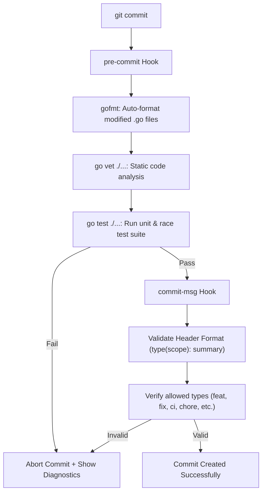
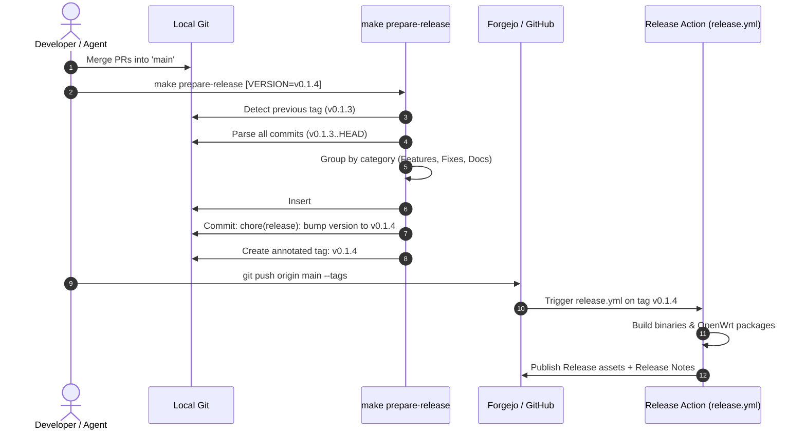

# GSM2MQTT: Developer & Release Workflow Guide

This guide describes the complete development, commit, quality assurance, and release lifecycle for GSM2MQTT contributors and release managers.

---

## 1. Commit Message Standard

GSM2MQTT uses structured, machine-parseable commit messages to automatically generate public release notes, press releases, and [CHANGELOG.md](../CHANGELOG.md).

### Format Specification

Every commit message follows the multi-line Git standard (50/72 rule):

```gitcommit
<type>(<scope>): <summary in imperative mood>

<Optional context paragraph explaining WHY and WHAT changed, wrapped at 72 chars>

- <Detailed product or technical bullet point 1>
- <Detailed product or technical bullet point 2>
- <Detailed product or technical bullet point 3>

Fixes #<issue-id>
BREAKING CHANGE: <description of breaking change, if any>
```

#### Alternative Bracket Syntax
The repository tooling and validators also support bracket notation:
```gitcommit
[<type>] (<scope>) <summary in imperative mood>
# or
[<type>] <summary in imperative mood>
```

---

### Commit Types

Commits are strictly categorized into **Product Changes** (included in public release notes) and **Internal Automation** (filtered out from user-facing notes):

| Type | Category | Appears in Release Notes? | Description |
|:---|:---|:---:|:---|
| `feat` | Product | **Yes** (`Features & Improvements`) | New user capabilities, modem models, MQTT topics, CLI flags, config options |
| `fix` | Product | **Yes** (`Bug Fixes`) | Bug fixes, AT engine error recoveries, race conditions, memory leaks |
| `perf` | Product | **Yes** (`Performance Improvements`) | Latency reduction, serial baud optimizations, memory or binary footprint reduction |
| `docs` | Product | **Yes** (`Documentation`) | User-facing documentation (`README.md`, `docs/*.md`) |
| `refactor` | Product / Internal | Optional | Internal code reorganization with zero behavior change |
| `ci` | Automation | **No** (Filtered out) | CI/CD workflows, GitHub Actions, Forgejo Actions, runner configurations |
| `test` | Automation | **No** (Filtered out) | Unit tests, mock suites, integration fuzzers |
| `chore` | Automation | **No** (Filtered out) | Routine housekeeping, dependency bumps, release commits |
| `build` | Automation | **No** (Filtered out) | Makefile updates, build scripts, packaging tools |

---

### Multi-line Message Anatomy

1. **Header Line (Subject)**:
   - Max 72 characters (recommended <= 50).
   - Imperative mood (*"add support"*, not *"added"* or *"adds"*).
   - No period at the end.
2. **Blank Line**:
   - Mandatory separation between header and body.
3. **Body Paragraph(s)**:
   - Explains the **motivation** (why is this change necessary?) and **behavioral effect**.
   - Wrapped at 72 characters per line.
4. **Bullet Points**:
   - Prefixed with `- `.
   - Detail specific files, configuration keys, or API endpoints affected.
5. **Footer**:
   - Issue tracker references (`Fixes #10`, `Closes #42`).
   - `BREAKING CHANGE:` trigger for SemVer Major bumps.

#### Example

```gitcommit
feat(config): support copying example configuration to working config with custom QoS

Allow users and CI environments to bootstrap a working gsm2mqtt.yaml directly
from the example configuration template while customizing MQTT QoS on the fly.

- Add CopyExampleConfig to generate working YAML configuration with custom QoS
- Export ModemRunner.QoS() to inspect active modem runner QoS level
- Update TestLoad_MainConfig to automatically bootstrap working config in CI
- Add integration test verifying working config QoS applies to runner and manager

Fixes #10
```

---

## 2. Git Hooks Pipeline (`.githooks/`)

To relieve developers and AI agents from repetitive manual verification, git hooks automate code quality, static analysis, test execution, and commit message validation before commits enter the repository.

### Hook Pipeline Overview



### Installation

Enable project hooks with a single command:
```bash
make setup-hooks
```
This configures `git config core.hooksPath .githooks` and ensures execute permissions.

### What Each Hook Does

1. **`pre-commit`**:
   - **Auto-Formatting (`gofmt -s -w`)**: Detects staged `.go` files, formats them automatically, and re-stages them into the current commit.
   - **Static Analysis (`go vet ./...`)**: Checks for suspicious constructs, dead code, and format specifier errors.
   - **Test Suite (`go test -count=1 ./...`)**: Executes tests to prevent regression commits. If tests fail, the commit is aborted.
2. **`commit-msg`**:
   - Inspects the commit message file.
   - Ignores automated merge commits (`Merge ...`) and fixups (`fixup!`, `squash!`).
   - Validates that non-merge commits strictly follow the format rules.

---

## 3. Release Lifecycle & Process (Release Cut)

### The Problem: When to Tag and How to Version?

A common dilemma is the versioning sequence:
- If you tag a commit first, `CHANGELOG.md` inside that commit doesn't know about that tag yet.
- If you update `CHANGELOG.md` first, the tag doesn't exist yet, and automatic tools cannot determine the version boundaries.
- Furthermore, accumulating multiple `feat` commits should **not** force premature minor version bumps; you may want to release several features together as a patch (e.g. `v0.1.4`) or milestone.

### The Solution: The Release Cut Workflow



---

## 4. Step-by-Step Developer Workflow

### Step 1: Feature Development in `development` Branch
1. Create or switch to your feature branch:
   ```bash
   git checkout development
   ```
2. Make code edits, write unit tests.
3. Commit changes using structured messages:
   ```bash
   git commit -m "feat(ussd): add UCS-2 cyrillic response parser"
   ```
   *(The `pre-commit` and `commit-msg` hooks will format code and verify tests automatically).*

### Step 2: Open PR into `main`
1. Push branch:
   ```bash
   git push origin development
   ```
2. In Forgejo/GitHub, open a Pull Request targeting `main`.
3. CI automatically runs on the PR:
   - Host build verification (`make build`).
   - Full cross-compilation check (`make build-all`).
   - Test suite with data-race detection (`go test -race`).
4. Merge the PR into `main`.

### Step 3: Preparing the Release (Release Cut)
Switch to the updated `main` branch:
```bash
git checkout main
git pull origin main
```

Run the automated release preparation target:
```bash
# Default: automatically increments patch version (e.g. v0.1.3 -> v0.1.4)
make prepare-release

# Explicit version:
make prepare-release VERSION=v0.1.4

# Bump minor version (when ready for a milestone):
make prepare-release BUMP=minor
```

#### What `make prepare-release` does automatically:
1. Validates that the working tree is clean.
2. Identifies the previous release tag (`v0.1.3`).
3. Collects all accumulated commits since the last tag (`v0.1.3..HEAD`).
4. Formats product changes into Keep a Changelog syntax.
5. Updates `CHANGELOG.md` with the new version section.
6. Commits `CHANGELOG.md` with message `chore(release): bump version to v0.1.4`.
7. Creates an annotated Git tag `v0.1.4` pointing to that commit.

### Step 4: Publish the Release
Push the release commit and tag to the remote server:
```bash
git push origin main --tags
```

Once pushed, Forgejo and GitHub Actions automatically:
1. Verify the tag format (`vMAJOR.MINOR.PATCH`).
2. Compile binaries for all target architectures (`amd64`, `arm64`, `riscv64`).
3. Build standalone OpenWrt packages (`.ipk` for OPKG and `.apk` for APK v3).
4. Generate SHA-256 checksums (`checksums.txt`).
5. Extract release notes from `CHANGELOG.md`.
6. Publish the release with all binary and package assets attached.

---

## 5. Command Reference Cheat Sheet

| Command | Purpose | When to Use |
|:---|:---|:---|
| `make setup-hooks` | Configures Git to use project hooks from `.githooks/` | Once after cloning or setting up workspace |
| `make build` | Builds static binary for host platform | During local development |
| `make build-all` | Cross-compiles for Linux `amd64`, `arm64`, `riscv64` | Before merging or releasing |
| `make test` | Runs complete test suite with race detector | Pre-commit / verification |
| `make vet` | Runs `go vet ./...` static analyzer | Code validation |
| `make lint` | Runs `golangci-lint` | Full linter inspection |
| `make changelog` | Previews or updates CHANGELOG for current HEAD | Manual changelog inspection |
| `make release-notes` | Previews formatted release notes markdown | Release preview |
| `make prepare-release` | Accumulates commits, updates CHANGELOG, commits & tags | When cutting a new version on `main` |
| `make package-openwrt` | Builds both OPKG (`.ipk`) and APK (`.apk`) packages | Local OpenWrt packaging |
| `make clean` | Cleans `bin/`, `dist/`, and coverage artifacts | Housekeeping |
