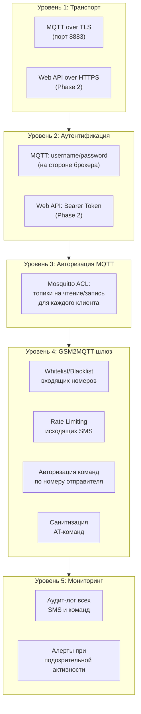
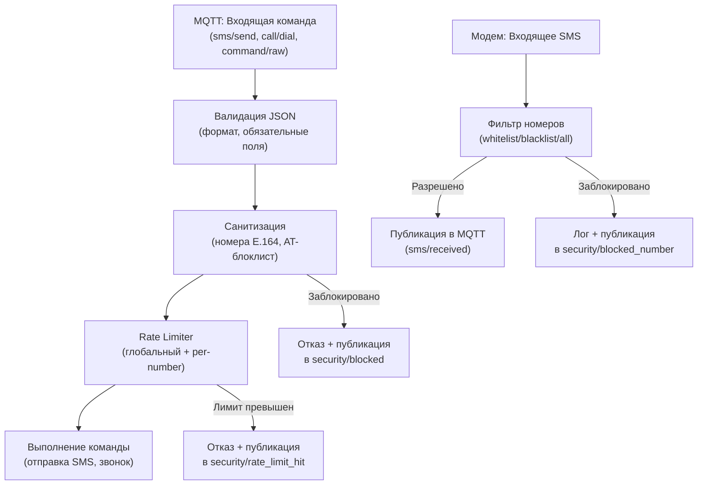

# GSM2MQTT — План реализации v2

## Описание проекта

**GSM2MQTT** — шлюз-сервис на Go, обеспечивающий бесшовное подключение GSM-модемов различных типов к системам домашней автоматизации через протокол MQTT. Сервис управляет модемами через AT-команды и публикует/получает данные через MQTT-топики.

### Принятые решения (из обсуждения)

| Вопрос | Решение | Обоснование |
|:---|:---|:---|
| Лицензия | **Apache 2.0** | См. [раздел ниже](#лицензия--apache-20) |
| Go module path | `github.com/legoser/gsm2mqtt` | — |
| Минимальная Go | **1.22+** | Улучшенный `net/http` routing, оптимизация runtime |
| Зависимости | **Минимум, аудит каждой** | См. [аудит зависимостей](#аудит-зависимостей) |
| Конфигурация | YAML + ENV override | — |
| MQTT брокер | Mosquitto | — |
| HA интеграция | Только MQTT (пока) | — |
| Multi-modem | Архитектурно — да, MVP — один | — |

---

## Лицензия — Apache 2.0

> [!TIP]
> **Рекомендую Apache 2.0** вместо MIT или GPL. Вот почему:

| Критерий | MIT | Apache 2.0 | GPL v3 |
|:---|:---|:---|:---|
| Сообщество может развивать | ✅ | ✅ | ✅ |
| Коммерческое использование | ✅ | ✅ | ⚠️ С обязательствами |
| Патентная защита | ❌ | ✅ **Да** | ✅ |
| Обязан открывать доработки | ❌ | ❌ | ✅ **Да** |
| Барьер для контрибьюторов | Низкий | Низкий | Средний |
| Используют крупные IoT проекты | — | **Kubernetes, HA** | Zigbee2MQTT |

**Почему не GPL v3:**
- GPL требует, чтобы все производные работы были тоже GPL — это отпугивает разработчиков, которые хотят интегрировать шлюз в коммерческие решения
- Anti-tivoization clause в GPLv3 может создать проблемы для Hardware-вендоров, которые могут захотеть предустановить наш шлюз

**Почему не MIT:**
- MIT не даёт **патентной защиты** — если кто-то запатентует технологию, которую контрибьютор внёс в проект, он может потом предъявить иск пользователям
- Apache 2.0 явно предоставляет грант на патенты от контрибьюторов

**Почему Apache 2.0 лучше для сообщества:**
- Home Assistant использует Apache 2.0
- Kubernetes, gRPC, TensorFlow — Apache 2.0
- Контрибьюторы защищены патентным грантом
- Нет обязательства открывать производные работы, но добровольные контрибьюции приветствуются

---

## Аудит зависимостей

> [!IMPORTANT]
> Принцип: **каждая зависимость должна оправдать своё присутствие.** Если можно написать 200 строк вместо импорта библиотеки — пишем сами.

### Необходимые внешние зависимости (3 штуки)

#### 1. `go.bug.st/serial` — Serial Port
**Вердикт: ОСТАВИТЬ** (нельзя заменить разумным количеством кода)

| Аспект | Детали |
|:---|:---|
| Что используем | Открытие порта, настройка baud/parity/stop bits, чтение/запись |
| Почему нельзя написать самим | Требует системных вызовов `ioctl`, `termios` для Linux + Windows API для будущей совместимости. ~1500 строк platform-specific кода |
| CGO | **Нет на Linux** (pure Go). CGO только на macOS для USB enumeration, которое нам не нужно |
| Размер | Минимальный, нет транзитивных зависимостей на Linux |
| Альтернатива | `goiiot/libserial` — менее популярна, но тоже pure Go |

#### 2. `github.com/eclipse/paho.mqtt.golang` — MQTT Client
**Вердикт: ОСТАВИТЬ** (протокол сложный, самописная реализация ненадёжна)

| Аспект | Детали |
|:---|:---|
| Что используем | Connect, Publish, Subscribe, LWT, auto-reconnect, TLS |
| Почему нельзя написать самим | MQTT протокол — это бинарный протокол с QoS levels, keep-alive, session state, ~3000 строк только парсер пакетов |
| Транзитивные зависимости | `golang.org/x/net`, `gorilla/websocket` (WebSocket не нужен — можно исключить через build tags) |
| Альтернатива | `gonzalop/mq` — zero deps, но молодой проект. Можно рассмотреть, если Paho покажется слишком тяжёлым |

> [!NOTE]
> **Вариант:** Если мы не используем MQTT 5.0 и WebSocket, можно рассмотреть более лёгкую альтернативу. Но Paho — индустриальный стандарт, и его надёжность перевешивает лишние 2 MB бинарника.

#### 3. `gopkg.in/yaml.v3` — YAML Parser
**Вердикт: ОСТАВИТЬ** (YAML spec слишком сложен для самописного парсера)

| Аспект | Детали |
|:---|:---|
| Что используем | Unmarshal конфигурационного файла в Go-структуры |
| Почему нельзя написать самим | YAML 1.2 спецификация — ~80 страниц, anchors, multiline strings, type coercion. Самописный парсер будет содержать баги |
| Альтернатива — JSON | Можно, но YAML удобнее для конфигов (комментарии!) |
| Альтернатива — TOML | `github.com/BurntSushi/toml` — тоже внешняя зависимость, без выигрыша |
| Транзитивные зависимости | **Нет** — zero deps |

### Что пишем сами (НЕ берём библиотеки)

| Компонент | Вместо какой библиотеки | Примерный объём кода |
|:---|:---|:---|
| AT Command Engine | `warthog618/modem` | ~400 строк. Моему движку нужна только send/receive/parse, без SMS PDU (используем текстовый режим) |
| Config ENV override | `spf13/viper`, `kelseyhightower/envconfig` | ~100 строк. Рефлексия + `os.Getenv` |
| Structured logging | — | `log/slog` (стандартная библиотека Go 1.22) |
| HTTP server (Web UI) | `gin`, `echo`, `chi` | `net/http` (стандартная библиотека Go 1.22 с routing) |
| JSON handling | — | `encoding/json` (стандартная библиотека) |
| Signal handling | — | `os/signal` (стандартная библиотека) |
| Тесты | — | `testing` (стандартная библиотека) |
| Phone number validation | `nyaruka/phonenumbers` | ~50 строк базовой нормализации (E.164 формат) |

### Итоговый `go.mod`

```go
module github.com/legoser/gsm2mqtt

go 1.22

require (
    go.bug.st/serial v1.6.2              // Serial port communication
    github.com/eclipse/paho.mqtt.golang v1.5.0  // MQTT client
    gopkg.in/yaml.v3 v3.0.1              // Config file parser
)
// Итого: 3 прямых зависимости
```

> **Сравнение:** Типичный Go-проект аналогичного масштаба имеет 15-30 зависимостей. У нас — 3.

---

## Модель безопасности

### Многоуровневая защита



---

### Уровень 1: Транспорт (TLS)

**Реализация в GSM2MQTT:** поддержка подключения к MQTT-брокеру через TLS.

```yaml
mqtt:
  broker: "mqtt.example.com"
  port: 8883
  tls:
    enabled: true
    ca_cert: "/etc/gsm2mqtt/certs/ca.pem"       # CA сертификат
    client_cert: "/etc/gsm2mqtt/certs/client.pem" # Для mTLS (опционально)
    client_key: "/etc/gsm2mqtt/certs/client.key"
    insecure_skip_verify: false                    # НЕ пропускать верификацию
```

---

### Уровень 2–3: Аутентификация и авторизация MQTT (на стороне брокера)

> [!NOTE]
> Авторизация MQTT — это **ответственность брокера** (Mosquitto). GSM2MQTT подключается как клиент. Мы предоставим пример конфигурации Mosquitto.

```
# mosquitto.conf (пример для GSM2MQTT)
allow_anonymous false
password_file /etc/mosquitto/passwd

# ACL
acl_file /etc/mosquitto/acl

# /etc/mosquitto/acl:
# GSM2MQTT сервис — полный доступ к своим топикам
user gsm2mqtt_service
topic readwrite gsm2mqtt/#

# Home Assistant — может читать всё и писать команды
user homeassistant
topic read gsm2mqtt/#
topic write gsm2mqtt/modem/+/sms/send
topic write gsm2mqtt/modem/+/call/dial
topic write gsm2mqtt/modem/+/ussd/send

# Ограниченный пользователь — только чтение статуса
user monitoring
topic read gsm2mqtt/modem/+/status
topic read gsm2mqtt/modem/+/signal
```

**Что это даёт:**
- Только авторизованные клиенты могут отправлять SMS (писать в `sms/send`)
- Мониторинг-пользователь не может отправлять команды
- Каждый клиент видит только разрешённые топики

---

### Уровень 4: Защита на стороне шлюза GSM2MQTT

Это то, что мы **реализуем в нашем коде**. Ключевые компоненты:

#### 4.1 Whitelist / Blacklist входящих номеров

```yaml
security:
  # Режим фильтрации входящих SMS
  # "all"       — пересылать все SMS в MQTT (по умолчанию)
  # "whitelist"  — только от разрешённых номеров
  # "blacklist"  — все, кроме заблокированных
  incoming_filter: "all"
  
  # Whitelist номеров (если incoming_filter: "whitelist")
  whitelist:
    - "+79001234567"
    - "+79007654321"
  
  # Blacklist номеров (если incoming_filter: "blacklist")
  blacklist:
    - "+79009999999"
```

> [!IMPORTANT]
> **Важное решение:** Вы отметили, что MQTT должен просто пересылать данные, а фильтрация — на стороне Home Assistant. Я предлагаю **гибридный подход:**
>
> 1. **По умолчанию (`incoming_filter: "all"`)** — все входящие SMS публикуются в MQTT. HA сам решает, что с ними делать.
> 2. **При необходимости** — можно включить whitelist/blacklist **на шлюзе**, чтобы спам-SMS даже не попадали в MQTT.
> 3. **Всегда**: каждое входящее SMS публикуется с полем `from` — HA может фильтровать по номеру на своей стороне.
>
> В MQTT-сообщении всегда передаётся номер отправителя, чтобы HA мог применить свои правила:
> ```json
> {
>   "from": "+79001234567",
>   "text": "Сработала сигнализация",
>   "timestamp": "2026-09-22T09:15:00+07:00",
>   "modem_id": "siemens_tc35"
> }
> ```

#### 4.2 Rate Limiting исходящих SMS

Защита от SMS-бомбинга через MQTT:

```yaml
security:
  rate_limit:
    enabled: true
    # Максимум SMS за период
    max_sms_per_minute: 5
    max_sms_per_hour: 30
    max_sms_per_day: 100
    
    # Cooldown при превышении лимита
    cooldown_minutes: 10
    
    # Per-number лимиты
    max_sms_per_number_per_hour: 3
```

**Зачем это нужно на шлюзе:**
- Если MQTT-брокер скомпрометирован, атакующий может отправить тысячи SMS
- Каждое SMS стоит денег (баланс SIM)
- Модем физически ограничен (~6 секунд на SMS)

```go
// internal/security/ratelimit.go
type RateLimiter struct {
    mu          sync.Mutex
    global      *window  // Глобальный счётчик
    perNumber   map[string]*window  // Счётчик по номерам
    config      RateLimitConfig
}

func (rl *RateLimiter) Allow(number string) bool {
    rl.mu.Lock()
    defer rl.mu.Unlock()
    
    // Проверка глобального лимита
    if !rl.global.allow() {
        return false
    }
    
    // Проверка per-number лимита
    w, ok := rl.perNumber[number]
    if !ok {
        w = newWindow(rl.config.MaxPerNumberPerHour, time.Hour)
        rl.perNumber[number] = w
    }
    return w.allow()
}
```

#### 4.3 Санитизация AT-команд

Если мы разрешаем отправку raw AT-команд через MQTT (топик `command/raw`), это **опасно**:

```yaml
security:
  # Разрешить сырые AT-команды через MQTT
  allow_raw_at: false     # По умолчанию ВЫКЛЮЧЕНО
  
  # Если включено — список запрещённых команд
  # (даже если allow_raw_at: true)
  blocked_at_commands:
    - "AT+CFUN=0"         # Выключение модема
    - "AT+CPIN"           # Смена PIN
    - "ATD"               # Прямой набор (обходит rate limiter)
    - "AT&F"              # Сброс к заводским
    - "AT+CGDCONT"        # Изменение APN
```

**Почему это важно:**
- `AT+CFUN=0` — выключит модем
- `AT+CPIN` — можно заблокировать SIM-карту, введя неправильный PIN 3 раза
- `ATD` — обход rate limiter для звонков
- Любая AT-команда без таймаута может повесить serial port

#### 4.4 Аудит-лог

Все действия логируются:

```go
// Каждое отправленное/полученное SMS
logger.Info("sms_sent",
    slog.String("to", number),
    slog.String("modem", modemID),
    slog.String("source", "mqtt"),  // кто инициировал: mqtt, api, auto
    slog.Int("text_length", len(text)),
)

// Каждая raw AT-команда
logger.Warn("raw_at_command",
    slog.String("command", cmd),
    slog.String("modem", modemID),
    slog.String("source", "mqtt"),
)

// Попытка превышения rate limit
logger.Warn("rate_limit_exceeded",
    slog.String("number", number),
    slog.String("modem", modemID),
    slog.Int("count_last_hour", count),
)
```

---

### Уровень 5: Мониторинг (через MQTT)

Шлюз публикует метрики безопасности:

```
gsm2mqtt/security/
├── rate_limit_hit          # Событие: rate limit достигнут
├── blocked_number          # Событие: SMS от заблокированного номера
├── raw_at_attempt          # Событие: попытка raw AT (если выключено)
└── stats                   # Периодическая статистика
    # {"sms_sent_today": 15, "sms_received_today": 3, "blocked_today": 1}
```

---

### Web API Security (Phase 2)

```yaml
api:
  enabled: false
  listen: ":8080"
  
  # Аутентификация
  auth:
    # "none" — без аутентификации (только для локального использования!)
    # "token" — Bearer Token
    type: "token"
    token: ""  # Если пустой — генерируется при первом запуске и выводится в лог
  
  # Разрешённые IP (дополнительно к token)
  allowed_ips:
    - "127.0.0.1"
    - "192.168.0.0/24"
  
  # CORS (если Web UI отдельно)
  cors:
    allowed_origins: ["http://localhost:3000"]
```

---

## Дополнение к архитектуре: Security Layer



---

## Обновлённая структура каталогов

```
gsm2mqtt/
├── cmd/
│   └── gsm2mqtt/
│       └── main.go
├── internal/
│   ├── config/
│   │   ├── config.go           # Структуры конфигурации
│   │   └── loader.go           # YAML + ENV override (самописный)
│   ├── transport/
│   │   └── serial.go           # Serial port абстракция
│   ├── modem/
│   │   ├── modem.go            # Интерфейс модема
│   │   ├── detector.go         # Автоопределение типа
│   │   ├── at/
│   │   │   ├── engine.go       # AT command engine (самописный)
│   │   │   ├── parser.go       # Парсер ответов
│   │   │   └── commands.go     # Стандартные AT-команды
│   │   ├── drivers/
│   │   │   ├── driver.go       # Интерфейс драйвера
│   │   │   ├── siemens.go      # Siemens TC35/MC55/TC65
│   │   │   ├── simcom.go       # SIM800/SIM900
│   │   │   ├── huawei.go       # Huawei USB модемы
│   │   │   └── generic.go      # Обобщённый драйвер
│   │   └── manager.go          # Управление жизненным циклом
│   ├── services/
│   │   ├── sms.go              # SMS сервис
│   │   ├── call.go             # Call сервис
│   │   ├── ussd.go             # USSD сервис
│   │   └── status.go           # Мониторинг статуса
│   ├── mqtt/
│   │   ├── client.go           # MQTT клиент
│   │   ├── topics.go           # Определение топиков
│   │   ├── handler.go          # Обработка входящих команд
│   │   └── discovery.go        # Home Assistant Auto Discovery
│   ├── security/
│   │   ├── ratelimit.go        # Rate limiter (самописный)
│   │   ├── filter.go           # Whitelist/Blacklist номеров
│   │   ├── sanitizer.go        # Санитизация AT-команд
│   │   └── audit.go            # Аудит-лог
│   └── api/                    # Phase 2
│       ├── server.go
│       ├── middleware.go       # Auth, CORS, IP filter
│       └── handlers.go
├── configs/
│   ├── gsm2mqtt.example.yaml
│   └── mosquitto/
│       ├── mosquitto.example.conf
│       └── acl.example
├── deployments/
│   ├── docker/
│   │   ├── Dockerfile
│   │   └── docker-compose.yml
│   └── systemd/
│       └── gsm2mqtt.service
├── scripts/
│   ├── build.sh
│   └── install.sh
├── docs/
│   ├── configuration.md
│   ├── security.md
│   ├── supported-modems.md
│   └── mqtt-topics.md
├── .gemini/
│   └── AGENTS.md              # AI-агент инструкции
├── go.mod
├── go.sum
├── Makefile
├── README.md
├── LICENSE                     # Apache 2.0
└── .goreleaser.yml
```

---

## Полный файл конфигурации

#### [NEW] configs/gsm2mqtt.example.yaml

```yaml
# ============================================================
# GSM2MQTT Configuration
# ============================================================
# Environment variables override any YAML setting.
# Pattern: GSM2MQTT_<SECTION>_<PARAM> (uppercase, underscore-separated)
# Example: GSM2MQTT_MQTT_BROKER=192.168.1.100

log_level: info  # debug, info, warn, error

# -------------------------------------------------------
# MQTT Broker Connection
# -------------------------------------------------------
mqtt:
  broker: "localhost"                  # GSM2MQTT_MQTT_BROKER
  port: 1883                          # GSM2MQTT_MQTT_PORT (8883 for TLS)
  username: ""                         # GSM2MQTT_MQTT_USERNAME
  password: ""                         # GSM2MQTT_MQTT_PASSWORD
  client_id: "gsm2mqtt"               # GSM2MQTT_MQTT_CLIENT_ID
  topic_prefix: "gsm2mqtt"            # Корневой префикс топиков
  
  # Home Assistant MQTT Auto Discovery
  discovery: true
  discovery_prefix: "homeassistant"    # HA default
  
  # TLS (optional)
  tls:
    enabled: false
    ca_cert: ""
    client_cert: ""
    client_key: ""
    insecure_skip_verify: false

# -------------------------------------------------------
# Modems
# -------------------------------------------------------
modems:
  - id: "modem1"                       # Уникальный идентификатор
    name: "Siemens TC35"               # Человеко-читаемое имя
    port: "/dev/ttyS0"                 # Serial port path
    baud_rate: 9600                     # 9600, 19200, 38400, 57600, 115200
    type: "auto"                        # auto | siemens | simcom | huawei | generic
    pin: ""                             # SIM PIN (если требуется)
    
    # Расширенные настройки serial port
    data_bits: 8                        # 7, 8
    stop_bits: 1                        # 1, 2
    parity: "none"                      # none, odd, even
    flow_control: "none"                # none, hardware (RTS/CTS)

# -------------------------------------------------------
# Security
# -------------------------------------------------------
security:
  # Фильтрация входящих SMS по номеру
  incoming_filter: "all"               # all | whitelist | blacklist
  whitelist: []                         # ["+79001234567", "+79007654321"]
  blacklist: []
  
  # Rate limiting исходящих SMS
  rate_limit:
    enabled: true
    max_sms_per_minute: 5
    max_sms_per_hour: 30
    max_sms_per_day: 100
    max_sms_per_number_per_hour: 3
    cooldown_minutes: 10
  
  # Raw AT commands через MQTT
  allow_raw_at: false
  blocked_at_commands:
    - "AT+CFUN=0"
    - "AT+CPIN"
    - "ATD"
    - "AT&F"

# -------------------------------------------------------
# Status Monitoring
# -------------------------------------------------------
status:
  interval: 30s                        # Опрос статуса модема
  signal_interval: 60s                 # Опрос уровня сигнала

# -------------------------------------------------------
# Web API (Phase 2)
# -------------------------------------------------------
# api:
#   enabled: false
#   listen: ":8080"
#   auth:
#     type: "token"                    # none | token
#     token: ""
#   allowed_ips: ["127.0.0.1", "192.168.0.0/24"]
```

---

## Что осталось без изменений (из плана v1)

Следующие разделы полностью сохраняются из [плана v1](file:///home/ej/.gemini/antigravity-cli/brain/6357749f-b329-4cd5-9258-bc08e86bbbd2/gsm2mqtt-implementation-plan.md):

- **Архитектура** (диаграмма компонентов)
- **Структура MQTT-топиков** + HA Discovery
- **Отказоустойчивость** (watchdog, reconnect, LWT, retry)
- **State machine модема** (Disconnected → Connecting → Ready → Recovering)
- **Docker** (multi-stage build, docker-compose)
- **Makefile** (build, build-all, test, lint, docker)
- **Фазы реализации** (Phase 0–3)
- **Сравнение с аналогами** (sms2mqtt, OpenMQTTGateway)
- **Целевые платформы** (x86_64, ARM64, RISC-V)
- **Целевое оборудование** (Siemens, SIMCom, Huawei, Quectel)
- **GPRS/HTTP через AT-команды** (Phase 2, SIM800/Quectel)

---

## User Review Required

> [!IMPORTANT]
> ### Решение по Raw AT-командам
> По умолчанию raw AT-команды через MQTT **выключены** (`allow_raw_at: false`). Это самый безопасный вариант. Пользователь может включить их в конфиге, но это **его ответственность**. Согласны с таким подходом?

> [!WARNING]
> ### Rate Limiting по умолчанию
> Предложенные лимиты (5/мин, 30/час, 100/день) — консервативные. Для промышленного использования может потребоваться увеличение. Но для домашней автоматизации это разумные значения, предотвращающие случайные петли в автоматизациях HA.

---

## Verification Plan

### Phase 0 — Инициализация

```bash
# Проверка инициализации
go build ./...
go vet ./...
go test ./...

# Кросс-компиляция
GOOS=linux GOARCH=arm64 go build -o /dev/null ./cmd/gsm2mqtt/
GOOS=linux GOARCH=amd64 go build -o /dev/null ./cmd/gsm2mqtt/
```

### Phase 1 — Юнит тесты

```bash
# AT Engine с mock serial port
go test -v ./internal/modem/at/...

# Security (rate limiter, filter, sanitizer)
go test -v ./internal/security/...

# Config loader
go test -v ./internal/config/...

# MQTT handler с mock client
go test -v ./internal/mqtt/...
```

### Manual Verification

1. Подключить модем → GSM2MQTT определяет тип → публикует статус
2. Отправить JSON в `gsm2mqtt/modem/{id}/sms/send` → SMS доставлено
3. Отправить SMS на SIM → сообщение в `gsm2mqtt/modem/{id}/sms/received`
4. Превысить rate limit → отказ + событие в `security/rate_limit_hit`
5. Docker: `docker-compose up` → сервис работает

---

## Следующий шаг

После утверждения плана — **Phase 0: Инициализация проекта**:
1. `go mod init github.com/legoser/gsm2mqtt`
2. Структура каталогов
3. `README.md`, `LICENSE` (Apache 2.0), `.gitignore`, `Makefile`
4. Конфигурационный файл-пример
5. Dockerfile, docker-compose
6. Базовые интерфейсы и заготовки пакетов
7. `.gemini/AGENTS.md`
8. `git init` + первый коммит
