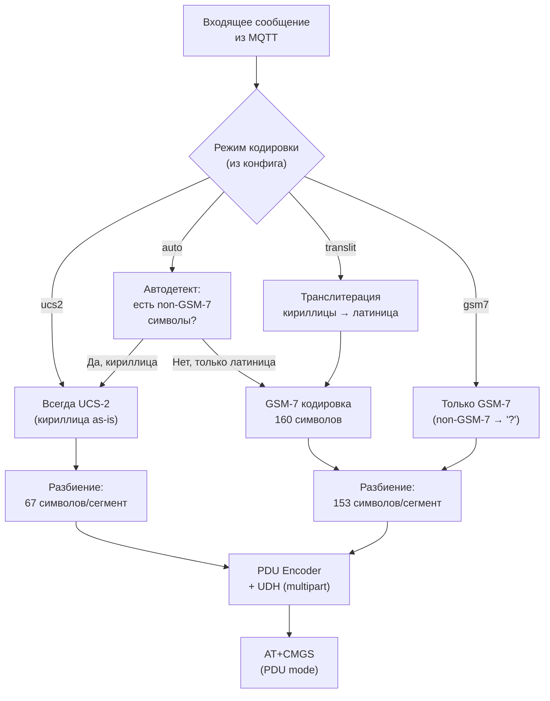

# GSM2MQTT — SMS Encoding & Кириллица (дополнение к плану v2)

## Проблема

SMS-сообщения имеют жёсткие ограничения на кодировку и длину. При работе с кириллицей эти ограничения становятся **критически важными**:

| Кодировка | Символы на сегмент | Символы (multipart) | Поддержка кириллицы |
|:---|:---|:---|:---|
| **GSM-7** | 160 | 153 | ❌ Нет |
| **UCS-2 (UTF-16BE)** | 70 | 67 | ✅ Да |

**Проблема:** Одно слово «Привет» на кириллице уменьшает лимит SMS в **2.3 раза** (с 160 до 70 символов). Длинное сообщение, которое уместилось бы в 1 SMS на латинице, может занять 3-4 SMS на кириллице.

---

## Решение: три режима кодировки + PDU mode



---

## Конфигурация

```yaml
sms:
  # Режим кодировки исходящих SMS
  # "auto"     — автоопределение (если есть кириллица → UCS-2, иначе GSM-7)
  # "translit" — транслитерация кириллицы в латиницу, затем GSM-7
  # "ucs2"     — всегда UCS-2 (поддержка любых символов, но 70 символов/SMS)
  # "gsm7"     — всегда GSM-7 (кириллица будет заменена на '?')
  encoding: "auto"
  
  # Поведение при длинных сообщениях
  # "split"    — автоматически разбить на multipart SMS
  # "truncate" — обрезать до 1 SMS (160 или 70 символов)
  # "reject"   — отклонить с ошибкой
  long_message: "split"
  
  # Максимум сегментов для multipart SMS
  max_segments: 4
  
  # Включить информацию о кодировке в MQTT-ответ
  report_encoding: true
```

---

## Детали реализации

### 1. PDU Mode — почему это обязательно

> [!IMPORTANT]
> **Мы используем PDU mode (`AT+CMGF=0`), а НЕ Text mode (`AT+CMGF=1`).**
>
> Причины:
> 1. **Text mode не поддерживает UCS-2 надёжно** — поведение зависит от модема
> 2. **Text mode не поддерживает multipart SMS** — нет возможности вставить UDH
> 3. **PDU mode работает одинаково на всех модемах** — Siemens, SIMCom, Huawei
> 4. **Входящие SMS тоже приходят в PDU** — нужен декодер в любом случае
>
> PDU mode — это бинарный протокол. Мы пишем PDU encoder/decoder **самостоятельно** (~300 строк), это хорошо документированный формат (3GPP TS 23.040).

### 2. GSM-7 Alphabet

Символы, поддерживаемые GSM-7 (7-бит):

```
@ £ $ ¥ è é ù ì ò Ç Ø ø Å å
Δ _ Φ Γ Λ Ω Π Ψ Σ Θ Ξ
^ { } \ [ ~ ] |
€ (extension table)
A-Z a-z 0-9
! " # ¤ % & ' ( ) * + , - . / : ; < = > ? ¡ § ¿
пробел, CR, LF
```

**Кириллица НЕ входит** в GSM-7. Даже одна кириллическая буква переключает всё сообщение в UCS-2.

### 3. PDU Encoder

#### [NEW] internal/sms/pdu/encoder.go

```go
package pdu

// Encoder создаёт PDU-пакеты для отправки через AT+CMGS.
// Поддерживает GSM-7 и UCS-2 кодировки, multipart SMS с UDH.

// EncodeSMS кодирует текстовое сообщение в один или несколько PDU.
// Автоматически выбирает кодировку и разбивает длинные сообщения.
func EncodeSMS(recipient string, text string, encoding Encoding) ([]PDU, error) {
    // 1. Определить кодировку
    enc := encoding
    if enc == EncodingAuto {
        if isGSM7Compatible(text) {
            enc = EncodingGSM7
        } else {
            enc = EncodingUCS2
        }
    }
    
    // 2. Определить лимиты
    var maxSingle, maxMultipart int
    switch enc {
    case EncodingGSM7:
        maxSingle = 160     // 160 символов в одном SMS
        maxMultipart = 153  // 153 символа (7 байт на UDH)
    case EncodingUCS2:
        maxSingle = 70      // 70 символов в одном SMS
        maxMultipart = 67   // 67 символов (6 байт на UDH)
    }
    
    // 3. Разбить на сегменты
    runes := []rune(text)
    if len(runes) <= maxSingle {
        // Одно SMS — без UDH
        return []PDU{encodeSinglePDU(recipient, runes, enc)}, nil
    }
    
    // Multipart — с UDH
    segments := splitRunes(runes, maxMultipart)
    refNum := generateRefNumber() // Уникальный ID для склейки
    
    pdus := make([]PDU, len(segments))
    for i, seg := range segments {
        pdus[i] = encodeMultipartPDU(recipient, seg, enc, refNum, len(segments), i+1)
    }
    return pdus, nil
}

// isGSM7Compatible проверяет, все ли символы входят в GSM-7 алфавит.
func isGSM7Compatible(text string) bool {
    for _, r := range text {
        if !gsm7Table[r] {
            return false
        }
    }
    return true
}
```

### 4. UDH (User Data Header) для multipart SMS

```
UDH структура (6 байт):
┌──────────────┬──────────────┬──────────────┬──────────────┬──────────────┬──────────────┐
│ UDH Length   │ IE ID        │ IE Data Len  │ Reference #  │ Total Parts  │ Part Number  │
│ 0x05         │ 0x00         │ 0x03         │ 0xXX         │ 0xXX         │ 0xXX         │
└──────────────┴──────────────┴──────────────┴──────────────┴──────────────┴──────────────┘

Пример для 3-частного SMS, часть 2:
05 00 03 A7 03 02
│  │  │  │  │  └── Часть 2 из 3
│  │  │  │  └───── Всего 3 части
│  │  │  └──────── Reference number = 0xA7 (одинаковый для всех частей)
│  │  └─────────── Длина данных IE = 3
│  └────────────── IE Identifier = 0x00 (concatenated SMS)
└───────────────── UDH Length = 5 байт
```

**Как телефон получателя склеивает:** Телефон собирает все SMS с одинаковым Reference Number, сортирует по Part Number и склеивает текст. Это стандарт GSM — работает на **всех** телефонах.

### 5. PDU Decoder (для входящих SMS)

#### [NEW] internal/sms/pdu/decoder.go

```go
package pdu

// DecodeSMS декодирует PDU-пакет полученного SMS.
// Поддерживает GSM-7, UCS-2, определяет multipart (UDH).
func DecodeSMS(pduHex string) (*IncomingSMS, error) {
    data, err := hex.DecodeString(pduHex)
    if err != nil {
        return nil, fmt.Errorf("invalid PDU hex: %w", err)
    }
    
    sms := &IncomingSMS{}
    offset := 0
    
    // 1. Service Center Address
    scaLen := int(data[offset])
    offset += 1 + scaLen
    
    // 2. PDU Type (first octet)
    pduType := data[offset]
    offset++
    hasUDH := (pduType & 0x40) != 0  // UDHI бит
    
    // 3. Sender Address
    sms.From = decodeSenderAddress(data, &offset)
    
    // 4. Protocol ID, DCS, Timestamp
    offset++ // PID
    dcs := data[offset]
    offset++
    sms.Timestamp = decodeTimestamp(data, &offset)
    
    // 5. User Data
    udl := int(data[offset])
    offset++
    
    // 6. Определить кодировку из DCS
    encoding := dcsToEncoding(dcs)
    
    // 7. Декодировать текст (с учётом UDH если есть)
    if hasUDH {
        udhLen := int(data[offset])
        sms.Multipart = decodeUDH(data[offset : offset+udhLen+1])
        offset += udhLen + 1
        // Уменьшить udl на UDH
    }
    
    sms.Text = decodeUserData(data[offset:], udl, encoding, hasUDH)
    sms.Encoding = encoding
    
    return sms, nil
}
```

### 6. Сборка multipart на приёме

```go
// internal/sms/assembler.go

// Assembler собирает multipart SMS в одно сообщение.
// Хранит неполные сообщения в буфере с TTL.
type Assembler struct {
    mu      sync.Mutex
    pending map[uint16]*partialMessage  // key: reference number
    ttl     time.Duration               // Таймаут ожидания остальных частей
}

type partialMessage struct {
    parts     map[int]*IncomingSMS  // key: part number
    totalParts int
    from       string
    createdAt  time.Time
}

// AddPart добавляет часть multipart SMS.
// Возвращает полное сообщение, если все части собраны.
func (a *Assembler) AddPart(sms *IncomingSMS) (*IncomingSMS, bool) {
    if sms.Multipart == nil {
        // Не multipart — вернуть как есть
        return sms, true
    }
    
    a.mu.Lock()
    defer a.mu.Unlock()
    
    ref := sms.Multipart.Reference
    pm, ok := a.pending[ref]
    if !ok {
        pm = &partialMessage{
            parts:      make(map[int]*IncomingSMS),
            totalParts: sms.Multipart.TotalParts,
            from:       sms.From,
            createdAt:  time.Now(),
        }
        a.pending[ref] = pm
    }
    
    pm.parts[sms.Multipart.PartNumber] = sms
    
    // Все части собраны?
    if len(pm.parts) == pm.totalParts {
        // Склеить текст в порядке Part Number
        assembled := assembleText(pm)
        delete(a.pending, ref)
        return assembled, true
    }
    
    return nil, false // Ждём остальные части
}
```

---

## Транслитерация кириллицы

### Таблица транслитерации (практический «Translit» стандарт)

> [!NOTE]
> Используем **практический «Translit»** стандарт (не ISO 9 с диакритиками), потому что:
> 1. Результат должен содержать только GSM-7 символы (без ž, č, š)
> 2. Сообщение должно быть читаемо для русскоговорящих получателей
> 3. Это де-факто стандарт для SMS-шлюзов

| Кириллица | Латиница | | Кириллица | Латиница |
|:---|:---|---|:---|:---|
| А а | A a | | Р р | R r |
| Б б | B b | | С с | S s |
| В в | V v | | Т т | T t |
| Г г | G g | | У у | U u |
| Д д | D d | | Ф ф | F f |
| Е е | E e | | Х х | Kh kh |
| Ё ё | Yo yo | | Ц ц | Ts ts |
| Ж ж | Zh zh | | Ч ч | Ch ch |
| З з | Z z | | Ш ш | Sh sh |
| И и | I i | | Щ щ | Shch shch |
| Й й | J j | | Ъ ъ | ʼ (апостроф) |
| К к | K k | | Ы ы | Y y |
| Л л | L l | | Ь ь | ʼ (апостроф) |
| М м | M m | | Э э | E e |
| Н н | N n | | Ю ю | Yu yu |
| О о | O o | | Я я | Ya ya |
| П п | P p | | | |

#### [NEW] internal/sms/translit.go

```go
package sms

// translitMap — таблица транслитерации кириллицы в латиницу.
// Используется практический «Translit» стандарт (SMS-friendly).
var translitMap = map[rune]string{
    'А': "A", 'Б': "B", 'В': "V", 'Г': "G", 'Д': "D",
    'Е': "E", 'Ё': "Yo", 'Ж': "Zh", 'З': "Z", 'И': "I",
    'Й': "J", 'К': "K", 'Л': "L", 'М': "M", 'Н': "N",
    'О': "O", 'П': "P", 'Р': "R", 'С': "S", 'Т': "T",
    'У': "U", 'Ф': "F", 'Х': "Kh", 'Ц': "Ts", 'Ч': "Ch",
    'Ш': "Sh", 'Щ': "Shch", 'Ъ': "'", 'Ы': "Y", 'Ь': "'",
    'Э': "E", 'Ю': "Yu", 'Я': "Ya",
    // Строчные
    'а': "a", 'б': "b", 'в': "v", 'г': "g", 'д': "d",
    'е': "e", 'ё': "yo", 'ж': "zh", 'з': "z", 'и': "i",
    'й': "j", 'к': "k", 'л': "l", 'м': "m", 'н': "n",
    'о': "o", 'п': "p", 'р': "r", 'с': "s", 'т': "t",
    'у': "u", 'ф': "f", 'х': "kh", 'ц': "ts", 'ч': "ch",
    'ш': "sh", 'щ': "shch", 'ъ': "'", 'ы': "y", 'ь': "'",
    'э': "e", 'ю': "yu", 'я': "ya",
}

// Transliterate конвертирует кириллицу в латиницу.
// Символы, отсутствующие в таблице, остаются без изменений.
func Transliterate(text string) string {
    var buf strings.Builder
    buf.Grow(len(text) * 2) // Кириллица может увеличить длину
    
    for _, r := range text {
        if lat, ok := translitMap[r]; ok {
            buf.WriteString(lat)
        } else {
            buf.WriteRune(r)
        }
    }
    return buf.String()
}
```

### Пример: «Сработала сигнализация в гараже»

| Режим | Результат | Символов | SMS |
|:---|:---|:---|:---|
| `ucs2` | Сработала сигнализация в гараже | 31 | 1 SMS (70 лимит) |
| `translit` | Srabotala signalizatsiya v garazhe | 34 | 1 SMS (160 лимит) |
| `auto` | Сработала сигнализация в гараже | 31 | 1 SMS (UCS-2) |

### Пример длинного сообщения:

**Текст:** «Внимание! Сработала сигнализация в гараже. Датчик движения зафиксировал активность в зоне 3. Камера записала 10 секунд видео. Проверьте немедленно.»

| Режим | Символов | Кодировка | Сегментов SMS |
|:---|:---|:---|:---|
| `ucs2` | 134 | UCS-2 | **2 SMS** (67+67) |
| `translit` | ~180 | GSM-7 | **2 SMS** (153+27) |
| `auto` | 134 | UCS-2 | **2 SMS** (67+67) |

> [!NOTE]
> Транслитерация **увеличивает** количество символов (Щ→Shch = 1→4). В редких случаях транслитерированное сообщение может занять **больше** сегментов, чем UCS-2 оригинал. Поэтому режим `auto` — оптимальный выбор для большинства случаев.

---

## MQTT API для SMS с кодировкой

### Отправка SMS

**Топик:** `gsm2mqtt/modem/{id}/sms/send`

```json
{
  "to": "+79001234567",
  "text": "Сработала сигнализация в гараже",
  "encoding": "auto"
}
```

Поле `encoding` — **опционально**. Если не указано, используется значение из конфига. Допустимые значения:
- `"auto"` — автоопределение (по умолчанию)
- `"translit"` — транслитерировать кириллицу
- `"ucs2"` — отправить кириллицу as-is
- `"gsm7"` — принудительно GSM-7 (кириллица → `?`)

### Подтверждение отправки

**Топик:** `gsm2mqtt/modem/{id}/sms/sent`

```json
{
  "to": "+79001234567",
  "text": "Сработала сигнализация в гараже",
  "encoding": "ucs2",
  "segments": 1,
  "original_length": 31,
  "transliterated": false,
  "timestamp": "2026-09-22T09:30:00+07:00"
}
```

### Получение SMS

**Топик:** `gsm2mqtt/modem/{id}/sms/received`

```json
{
  "from": "+79001234567",
  "text": "Полный текст длинного сообщения, склеенного из нескольких частей",
  "encoding": "ucs2",
  "segments": 2,
  "timestamp": "2026-09-22T09:31:00+07:00",
  "modem_id": "siemens_tc35"
}
```

> Multipart SMS **всегда** склеиваются Assembler'ом. В MQTT публикуется только полное сообщение. Поле `segments` показывает, из скольких частей оно было собрано.

---

## Обновление структуры каталогов

```
internal/
└── sms/
    ├── service.go          # SMS Service (send/receive orchestration)
    ├── translit.go          # Транслитерация кириллицы (~50 строк)
    ├── translit_test.go     # Тесты транслитерации
    ├── assembler.go         # Сборка multipart SMS
    ├── assembler_test.go
    └── pdu/
        ├── encoder.go       # PDU encoder (GSM-7, UCS-2, UDH)
        ├── encoder_test.go
        ├── decoder.go       # PDU decoder
        ├── decoder_test.go
        ├── gsm7.go          # GSM-7 таблица символов + encode/decode
        ├── gsm7_test.go
        ├── ucs2.go          # UCS-2 (UTF-16BE) encode/decode
        └── types.go         # Типы: PDU, IncomingSMS, MultipartInfo
```

> **Объём самописного кода:** ~600 строк (encoder + decoder + translit + assembler). Это заменяет зависимость от `warthog618/sms` или `gomaja/go-sms`, при этом покрывает именно наши потребности без лишнего.

---

## User Review Required

> [!IMPORTANT]
> ### Режим кодировки по умолчанию
> Предлагаю `encoding: "auto"` как значение по умолчанию:
> - Латиница → GSM-7 (160 символов) — экономит SMS
> - Кириллица → UCS-2 (70 символов) — сохраняет читаемость
>
> Пользователь может переключить на `"translit"` глобально или per-message.

> [!WARNING]
> ### PDU mode vs Text mode — необратимое решение
> Переход на PDU mode означает, что **все** взаимодействия с модемом (отправка и приём SMS) будут в бинарном PDU формате. Это добавляет ~600 строк кода, но обеспечивает:
> - ✅ Единообразную работу на всех модемах
> - ✅ Кириллицу без костылей
> - ✅ Multipart SMS
> - ✅ Полный контроль над кодировкой
>
> **Альтернатива:** Text mode проще (~100 строк), но не поддерживает кириллицу и multipart надёжно. Рекомендую PDU.

---

## Verification Plan

### Юнит-тесты PDU

```bash
go test -v ./internal/sms/pdu/...
go test -v ./internal/sms/...
```

Тест-кейсы:
- Кодирование/декодирование GSM-7: `"Hello World"` → PDU hex → обратно
- Кодирование/декодирование UCS-2: `"Привет мир"` → PDU hex → обратно
- Multipart GSM-7: 200 символов → 2 PDU с UDH → декодирование → сборка
- Multipart UCS-2: 100 кириллических символов → 2 PDU с UDH → декодирование → сборка
- Транслитерация: `"Щётка"` → `"Shchyotka"`
- Автодетект: смешанный текст `"Hello Мир"` → UCS-2
- Edge cases: пустая строка, только цифры, 160 символов ровно, 161 символ
